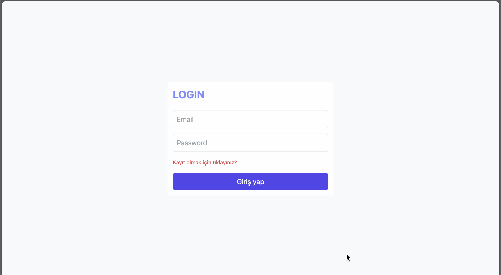

# mernStackAddPost_Project



## 🚀 Technologies Used

- **bcrypt** `^5.1.1`
- **body-parser** `^2.2.0`
- **cors** `^2.8.5`
- **dotenv** `^16.5.0`
- **express** `^5.1.0`
- **jsonwebtoken** `^9.0.2`
- **mongoose** `^8.14.1`
- **nodemon** `^3.1.10`

---

## 📦 Installation & Running the Project

### 1. Clone the Repository

```bash
git clone https://github.com/your-username/mernStackAddPost_Project.git
```

````Start the Frontend (Client)
cd client
cd my-app
npm start


```Start the Backend (Server)
cd server
cd my-app
npm start

````
